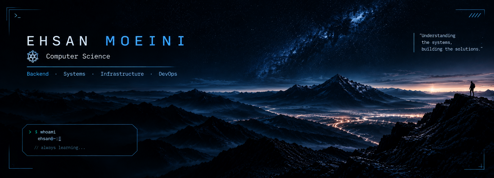

  

## About Me

<table>
<tr>
<td width="70%" valign="middle">

**Ehsan Moeini | BSc in Computer Science**

I’m a Computer Science student interested in the intersection of software engineering and systems.

My background includes programming, algorithms, backend development, and machine learning, while my current focus is moving deeper into Linux, infrastructure, containerization, and DevOps.

I enjoy both the theoretical side of computer science and the process of turning ideas into working software.

</td>

<td width="30%" align="center" valign="middle">

</td>
</tr>
</table>

  

## Connect with Me

  
  &nbsp;&nbsp;&nbsp;
  

  

## Profile Summary

  

  

# Tech Stack

  <b>LANGUAGES</b>

  
  

  

  <b>BACKEND & WEB</b>

  
  
  

  

  <b>SYSTEMS & DEVOPS</b>

  
  
  
  
  

  

  <b>DATA & MACHINE LEARNING</b>

  
  
  
  

  

# GitHub Stats

  

  

  

  

